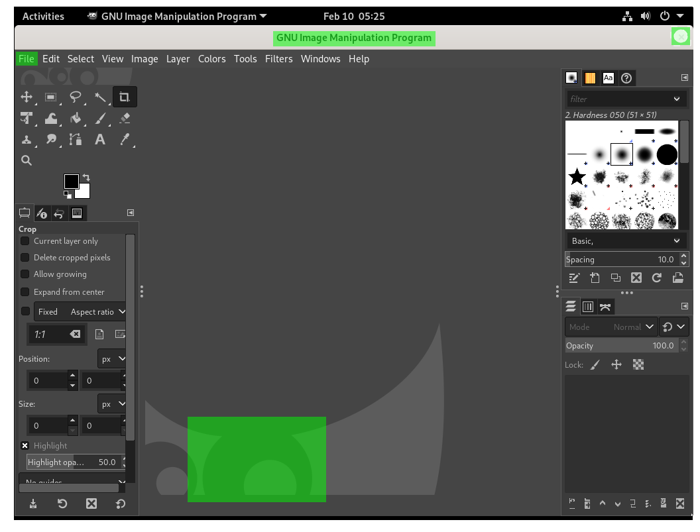

In this blog post we are going to give you the easiest introduction to what needles are and how you can use them.
While there are many good talks and documentation on needles out there, it took me longer than it should have to find a easy-to-use
and easy-to-understand introduction into this topic alone.
This blog post should fill this gap.

# What is a needle?

A needle is just a screenshot plus a definition, which part of that screenshot must match. Each of those parts also has a matching-parameter which determines, how good that region must match with the given prototype. Needles are identified by `tags`.

Let's break this description down top-to-bottom. This is a needle:

Don't get confused by the singular. A needle can consist of multiple regions and is still called "a needle".

Now let's look again at the figure above: You see a screenshot plus some green regions. When openQA looks for this needle it looks only at the green regions and ignores the rest. In order for the needle to match, each region needs to be present up to a given precision, which is defined via the `match` parameter.

And that's it. Exactly that is a needle. It is just a screenshot plus a json file which defines, what parts of that screenshot must match to what precision.
A needle also can handle mouse clicks, this will be covered later in this post.

## What are needles used for?

openQA shines when it comes to GUI testing. It is able to interact with a machine (virtual or bare-metal) without the need of accessibility interfaces or an additional toolkit, nor does it need to install anything on the system under test. It does so, by matching needles to the visual output of that machine and/or perform commands within a terminal.

Needles are used here to match the current screen output of a machine to a given predefined screenshot. For instance, when openQA tests the installation of a ISO image, it walks through the installation process screen by screen, matching each screen output of the machine against well-known needles and handling mouse clicks and typing events. Needles are just "look for XY" directives for openQA in order to validate, if the given screen is valid or not.
openQA can do much more, but this is beyond the scope of this article.

## Why are needles identified by "tags"?

Needles are identified with `tags` and multiple needles can match the same `tag`. This is needed because openQA is able to test different versions and flavors of one distribution at the same time.
A needle which should match for instance Firefox on gnome might looks slightly different on openSUSE Leap than on Tumbleweed. Because the underlying test script is the same, but the screen might looks slightly different, there is a need to support multiple needles with the same `tag`.

Another reason is that a update for instance of the font might change the appearance of a Needle just enough, that the old one does not match anymore.
This is a well-known issue and the reason for some extensive "re-needling" some times. Font or logo changes are good examples of when this is needed.

Old needles are typically not deleted but kept, in the case one needs to re-run those test runs for whatever reason.

## Needles and mouse-click events

Needles are the closest part to the GUI in openQA, which makes them also the most suitable place for handling mouse-click events. Each needle can define a region, where openQA should click when that needle is matched. Don't worry, mouse-clicks are handled only, if the underlying test script tells it to do so (by using e.g. `assert_and_click` instead of `assert_screen`).

## Perspective from the raw needles files

Another approach of trying to understand needles is to look how needles are stored on the disk. The needles for openSUSE for instance are found on [github.com/os-autoinst/os-autoinst-needles-opensuse](https://github.com/os-autoinst/os-autoinst-needles-opensuse).

Let's look again at the example needle from above. This needle consists of two files: 

* [flatpak-gimp-launched-20210210.png](flatpak-gimp-launched-20210210.png) - The screenshot
* [flatpak-gimp-launched-20210210.json](flatpak-gimp-launched-20210210.json) - The definition file

The screenshot is really just the screenshot as png file. The definition file is a `json` file that looks like the following:

    {
      "area": [
        {
          "xpos": 391,
          "ypos": 34,
          "width": 246,
          "height": 25,
          "type": "match",
          "match": 90
        },
        {
          "xpos": 4,
          "ypos": 69,
          "width": 28,
          "height": 19,
          "type": "match",
          "match": 90
        },
        {
          "xpos": 276,
          "ypos": 627,
          "width": 183,
          "height": 119,
          "type": "match",
          "match": 85
        },
        {
          "xpos": 998,
          "ypos": 37,
          "width": 16,
          "height": 17,
          "type": "match",
          "click_point": {
            "xpos": 8,
            "ypos": 8.5
          }
        }
      ],
      "properties": [],
      "tags": [
        "flatpak-gimp"
      ]
    }

We can see here, that it defines three rectangular areas, defined with via their upper-left position (`xpos`, `ypos`) and their `width` and `height`. Those match exactly the green boxes in the example figure above. This needle has a single tag `flatpak-gimp`. In addition it also has a `click_point` in one of the areas, which defines the position where a mouseclick would happen, if desired.

If you would like to match for this needle, you could do it as follows.

    # only match the given needle
    assert_screen('flatpak-GIMP');
    
    # match the given needle and perform a mouse-click on the defined coordinates
    assert_and_click('flatpak-GIMP');

How to use needles when writing openQA tests will be covered in a different blog post.

# TL;DR

* A needle is a screenshot plus a definition, which part of that screenshot must match to which precision
* Needles are identified by `tags` and multiple needles can match a tag
* Among others, font and logo changes are often reason for "re-needling", i.e. creating new needles because the old ones don't match any more