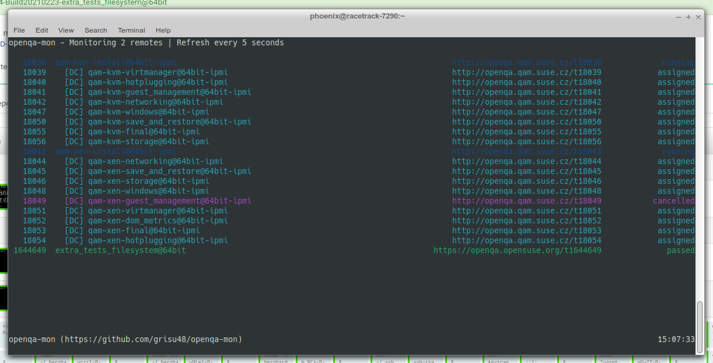
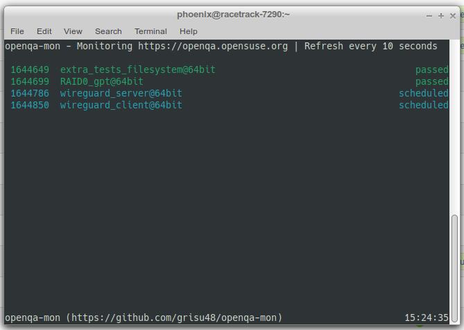
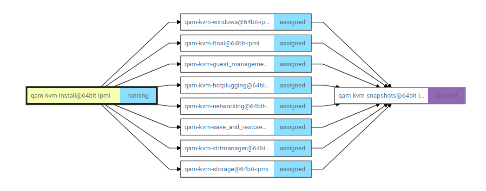
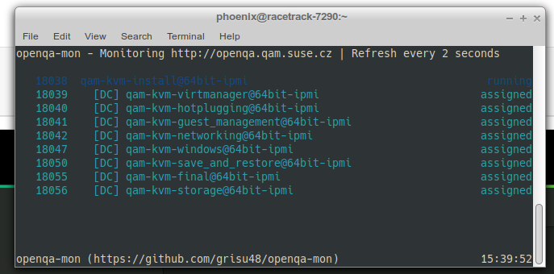

[`openqa-mon`](https://github.com/grisu48/openqa-mon) is a little command-line utility to monitor one or multiple openQA jobs for their status. This tool is useful if you want to live monitor a handful of jobs closely e.g. for verification runs.

## Example

We have been using this tool for half a year already to monitor our virtualization runs. Virtualization runs are a complex construct that run on bare-metal hosts. Our virtualization setup is constantly improving but still sometimes a bit fragile and requires close monitoring. This is what this tool was originally created for.

# Installation

`openqa-mon` is about to be packaged via OBS (See my [home project for openqa-mon](https://build.opensuse.org/package/show/home:ph03nix/openqa-mon)) but not yet fully there. In the meantime there are two ways, how you can install `openqa-mon`. The easiest is to use the provided binaries from the [Alpha4 release on GitHub](https://github.com/grisu48/openqa-mon/releases/tag/v0.12a), or you build it yourself

## Build instructions

`openqa-mon` is intentionally kept tidy, so this tool is happy with just a basic go compiler and does not require any external libraries until now.

    git clone https://github.com/grisu48/openqa-mon
    cd openqa-mon
    make openqa-mon
    ./openqa-mon -h

This builds the binary `openqa-mon`, which then ends up in the current directory. For systemwide access copy this file to `/usr/local/bin` (or similar).

# Usage

The most basic usage is the following:

    openqa-mon [OPTIONS] JOBS

`JOBS` are the jobs you want to monitor via their URL. `OPTIONS` are optional but useful program arguments that let you control how `openqa-mon` behaves. The best way to dive into the usage is by showing how we use it.

## Example usage

Let's assume I want to monitor the following jobs from today's Tumbleweed runs:

* `RAID0_gpt` - https://openqa.opensuse.org/tests/1644699
* `extra_tests_filesystem` - https://openqa.opensuse.org/tests/1644649
* `wireguard_client` - https://openqa.opensuse.org/tests/1644850
* `wireguard_server` - https://openqa.opensuse.org/tests/1644786

I want to get notifications when a job changes its status (`-n`) and
 `openqa-mon` should follow the job, i.e. show me the cloned job if present (`-f`). The later is useful to monitor restarted jobs. In addition, I want `openqa-mon` to update the job status every 10 seconds (`--continuous 10`). Then the command looks like the following:
 
     openqa-mon -nf --continuous 10 https://openqa.opensuse.org/tests/1644699 1644649 1644850 1644786

Mind how we only needed to add job numbers and not the full URL after one job has been specifying the instance. Of course, you are free to still use the full URL.

Now every 10 seconds, `openqa-mon` fetches the current job status and when the job changes its status then you will get a desktop notification. Awesome!

## Monitoring a job and its children

Our virtualization runs look like the following:

`qam-kvm-install` is the step that setups up the Hypervisor, followed by a set of individual test cases. If we want to monitor this runs it's cumbersome to define all job IDs. This is why we came up with the `-p` parameter (or `--hierarchy`) for showing the job hierarchy. This means, `openqa-mon` will automatically also add the children of the defined jobs.

    openqa-mon -mfpc 30 http://duck-norris/tests/18038           # duck-norris is my own openQA

This is cool because of two things. First, you see 9 jobs, but you have only selected one single job ID. This is because `openqa-mon` fetches the job and it's children. Second, you see the `[DC]` in front of the children jobs. `[DC]` stands for directly chained children.

The example code above is what we use most of the times in practice for active monitoring of virtualization runs. Another way of using it is when you want to actively and closely monitor a verification run. That's why this utility has been developed in the first place!

## Advanced usage

For more program parameters run `openqa-mon -h` or consult the man page (when installing from OBS). `openqa-mon -h` lists a complete description of the available program arguments.

In addition, I want to show you two nice gimmicks, that can make your life with `openqa-mon` easier. `openqa-mon` also supports defining jobs by range. Look at the following two examples:

    openqa-mon -mfc 10 https://openqa.opensuse.org/tests/1644699+2
    
    openqa-mon -mfc 10 https://openqa.opensuse.org/tests/1644699..1644705
    
    openqa-mon -mfc 10 https://openqa.opensuse.org/tests/1644699 http://duck-norris/tests/18038

The first line monitors the jobs 1644699 1644700 and 1644701. When the job ID contains a `+`, `openqa-mon` interprets it as "the given job plus the following numbers `n`". So here it means, the job itself plus the next two ID's as well.

The second line allows you to define a custom job range. This is very similar to the `+`. Here, `openqa-mon` will monitor all jobs from 1644699 to (inclusive) 1644705. This means, `openqa-mon` will monitor 1644699, 1644700, 1644701, 1644702, 1644703, 1644704 and 1644705.

The third line shows that you can monitor jobs from multiple instances at the same time. This is sometimes necessary and useful to have in one terminal without using `tmux`, `terminator` or similar.

`-mfbc 10` is my most commonly used parameter set. It means I want to monitor `-m` the jobs, i.e. enable bell and desktop notifications, follow the jobs `-f` and refresh the job list every ten seconds `-c 10`.

# TL;DR

* [`openqa-mon`](https://github.com/grisu48/openqa-mon) actively monitors your openqa jobs and notifies you about job changes
* Use this tool to babysit jobs, like complex test cases or verification runs
* Install: Use the pre-compiled binaries in [releases](https://github.com/grisu48/openqa-mon/releases) or build it yourself (easy)
* Packages via OBS will come soon ([preliminary project](https://build.opensuse.org/package/show/home:ph03nix/openqa-mon))

Usage example which is probably most commonly used:

    openqa-mon -mfc 10 https://openqa.opensuse.org/tests/1644699 1644705+2 1644720..1644725
               |                                         |       |         |
               # -m  - Desktop & bell notifications      |       |         # job range
                 -f  - Follow jobs (show restarted jobs) |       |
                 -c 10  - refresh every 10 seconds       |       # jobid plus next two jobs
                                                         # Instance and single job id

`openqa-mon` also supports jobs across different instances, e.g.

    openqa-mon -mfc 10 https://openqa.opensuse.org/tests/1644699 http://duck-norris/tests/18038