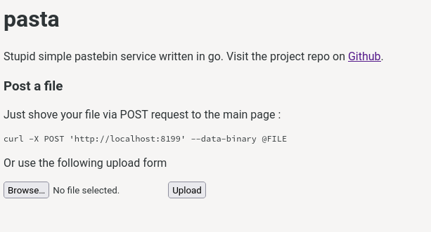

[`pasta`](https://github.com/grisu48/pasta) is a stupid simple pastebin service for self-hosting. I started this project months ago because I was missing an easy, simple and no pain self-hosting solution. This is what `pasta` is about. You just throw a file at it via it's archaic web interface, a simple `POST` request or with its stupid simple CLI tool:

    $ pasta pasta.txt                                 # push pasta.txt file
    https://pasta.feldspaten.org/JUa0ws6E             # resulting link

Pushed pastes are called **pastas** and they automatically expire after 1 month (can be changed by the server config). Once submitted you get a modification token, which you can use to modify and delete accidentally submitted pastas.

The `pasta` client runs out of the box against the default localhost URL. The `pastad` server only requires a simple configuration file and a data directory. No database or other dependencies are required. That's why I call it stupid simple.

# Installation

`pasta` is within my [tools repository](https://build.opensuse.org/package/show/home%3Aph03nix%3Atools/pasta) and can be found on [software.opensuse.org](https://software.opensuse.org/package/pasta). I might at some point dare to submit it to the official openSUSE repositories, if the project is considered useful to enough people. For now I'd like to keep it "experimental".

On openSUSE you can easily install it by adding my repository:

    # Tumbleweed
    zypper addrepo https://download.opensuse.org/repositories/home:ph03nix:tools/openSUSE_Tumbleweed/home:ph03nix:tools.repo
	# Leap 15.3
    zypper addrepo https://download.opensuse.org/repositories/home:ph03nix:tools/openSUSE_Leap_15.3/home:ph03nix:tools.repo
	# Leap 15.2
    zypper addrepo https://download.opensuse.org/repositories/home:ph03nix:tools/openSUSE_Leap_15.2/home:ph03nix:tools.repo

    zypper refresh
    zypper install pasta

The package ships the `pasta` client and the `pastad` server daemon.

On any other Linux platform, you might consider just using the [pre-compiled binaries](https://github.com/grisu48/pasta/releases) or build it yourself from the [source repository](https://github.com/grisu48/pasta). The `pastad` server also comes as container, see the corresponding section below.


# Pasta client

The `pasta` client can push arbitrary files to a defined pasta server. It prints the URL and keeps the modification token in a local state file. With the modification token you can delete your pastas at any given time, in case you need to remove an accidentally pushed file.

See the following usage example:

    ## push a file to my pasta server
    
    $ pasta pasta.txt -r https://pasta.feldspaten.org
    https://pasta.feldspaten.org/tCudxWmL


    ## list pushed pastas
    
	$ pasta ls
	Id   Filename                     Date                  URL
	0    pasta.txt                    2021-07-14 15:55:23   https://pasta.feldspaten.org/tCudxWmL
	1    pasta.txt                    2021-07-14 15:58:18   https://pasta.feldspaten.org/JUa0ws6E
    
    
    ## Delete pasta with Id 0 (e.g. because it was accidentally pushed)
    
	$ pasta rm 0
	Deleted: tCudxWmL

pastas can also be created from stdin (CTRL+D to close the stream).

    $ pasta -r https://pasta.feldspaten.org
    Reading from stdin
    Hello World!
    https://pasta.feldspaten.org/5OMqlvpd

The default remote is localhost but can be configured within the `~/.pasta.toml` configuration file

    # Set default remote server, if not set via "-r"
    RemoteHost = "https://pasta.feldspaten.org"

# Pasta server

The pasta server requires only a configuration file and a data directory, where the pastas will be stored. Metadata will be stored within the same file as a pasta itself, thereby no database is required.

## Deployment via podman container 

*The same procedure should also work with `docker` by replacing `podman` with `docker`.*

The easiest way to setup your own pasta server is via a podman container. We first need to configure the data directory, assuming it to be in `/srv/pasta`. We create the directory, assign it to your user (consider a dedicated user if you want to run it on a server) and create the configuration file as follows:

    ## create necessary data directories
    sudo mkdir /srv/pasta
	sudo chown phoenix /srv/pasta        # not needed if you run docker
	mkdir /srv/pasta/pastas              # create directory for pastas
	
	## Create configuration file from template
	wget -O /srv/pasta/pastad.toml https://github.com/grisu48/pasta/raw/main/pastad.toml.example
	vim /srv/pasta/pastad.toml           # adjust to your needs

See also the mirrored [pastad.toml.example](pastad.toml.example) here on the blog, in case of 404 errors or if the format unexpectedly changes.

Then let's create the `podman` container and run it

    podman container create --name "pasta" -p 8199:8199 -v /srv/pasta:/data grisu48/pasta
    podman start "pasta"

Check if the service is running properly by visiting [http://localhost:8199](http://localhost:8199). You should see this (archaic) web interface:



You can use this right away or use the `pasta` client to interact with it. If no configured otherwise in `~/.pasta.toml`, the client uses http://localhost:8199 as remote server.

And that's all you need to run it. That's why it's called "stupid simple" :-)

* * * 

Note: I currently only have a container for `x86_64` (because I'm lazy). I will include at least `aarch64` in the future, so you can also run it on your nice little ARM boards. It's on my TODO-list and I also want to have it.


# TL;DR

* pasta is a stupid simple pastebin service, it only requires a config file and a data directory to work
* Easy deploy it via a provided container (tested with `podman` and `docker`) - See the section "Deployment via podman container" below
* Use the `pasta` client to quickly push files from your terminal
* Configure the default host where `pasta` pushed your pastes ("pastas") via `~/.pasta.toml`:

```toml
# Default server where pastas are pushed to
RemoteHost = "https://pasta.feldspaten.org"
```

* Archaic webinterface, which "just works"
* Alternative: Just use `curl` to push a file: `curl -X POST 'https://pasta.feldspaten.org' --data-binary @pasta.txt` (push `pasta.txt` to https://pasta.feldspaten.org)
