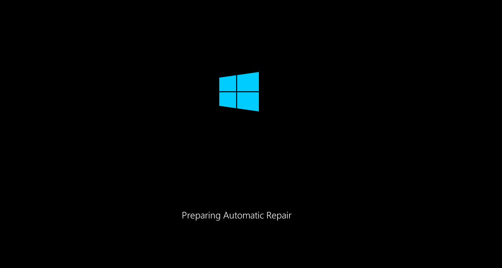

In this encore to the [Run Azure images in Hyper-V or kvm](/posts/2021-12-01-run-azure-image-on-hyperv/) will briefly discuss, if it is possible to create your own Hyper-V Windows Hypervisor as a kvm guest on Linux.

**No, you can't** (at least not on my Intel-Based Laptop).

Once you install Hyper-V, the guest won't be even able to boot. My guest is stuck at booting with "Preparing Automatic Repair".



I tried both methods: Via PowerShell:

```PowerShell
Enable-WindowsOptionalFeature -Online -FeatureName Microsoft-Hyper-V -All
```

and via the [Windows Features dialog through Settings](https://docs.microsoft.com/en-us/virtualization/hyper-v-on-windows/quick-start/enable-hyper-v) (to make sure, that all relevant tools are installed). In both cases, the result is the same.

# The story behind

Sometimes when dealing with issues on our Azure images, it is useful to have full control over the hypervisor instead of the publiccloud blackbox, where you only have a limited amount of possibilities available.

Since the [Nested Virtualization Microsoft Docs](https://docs.microsoft.com/en-us/virtualization/hyper-v-on-windows/user-guide/nested-virtualization) look kinda promising, I gave it a shot, but it was unfortunately unsuccessful.

To make sure, nested virtualization is enabled, I (re)loaded the `kvm_intel` module and checked the parameter (use `kvm_amd nested=1` for AMD processors)

    # modprobe kvm_intel nested=1
    # cat /sys/module/kvm_intel/parameters/nested
    Y
    # modinfo kvm_intel | grep -i nested               # use modinfo kvm_amd for AMD processors
    parm:           nested_early_check:bool
    parm:           nested:bool

This means that I have to rely on our internal Windows 2019 bare metal Hypervisor server and don't have my own Hyper-V lab readily available on my laptop in case I'm traveling.