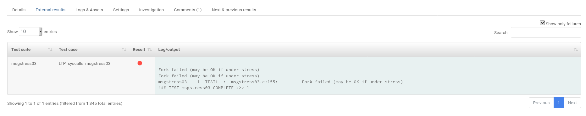
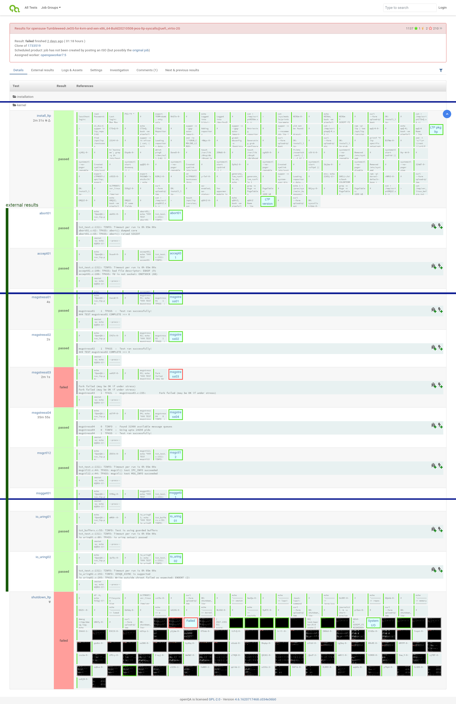
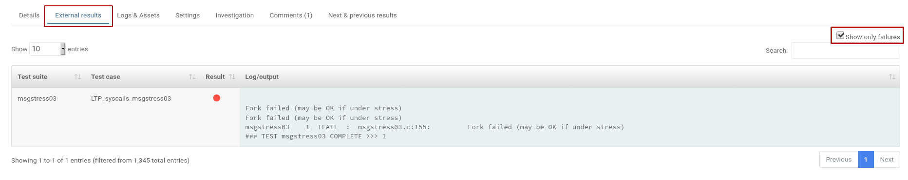
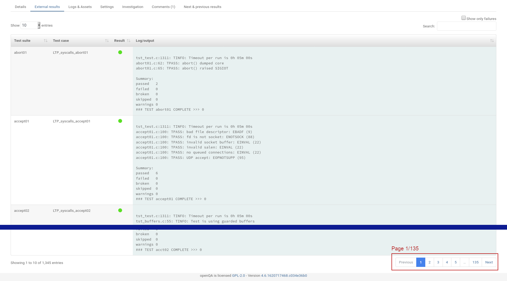

I just recently discovered one of the hidden gems in the openQA WebUI: Show only failing tests in external results.

## Problem / User story

Certain tests like [`ltp`](https://linux-test-project.github.io/) perform a series of tests within a test run and show the results as "External results". 
This is useful, because it allows to show more details about which substeps are being perform within a test. It allows to show a passing or failing state of those substeps directly in the WebUI.
For instance, in the [Tumbleweed JeOS `ltp-syscalls`](https://openqa.opensuse.org/tests/1733896#) test case, it shows all running `syscalls` tests and you are able to identify the failaing syscalls, instead of just the whole `ltp-syscalls` test failing.

In a nutshell: openQA will show certain substeps as individual test cases in the WebUI with their corresponding passed/failed state.

Showing those substeps as tests with their state is a handy feature of the WebUI, but it might also become cumbersome when reviewing. One needs to scroll through an endless list of passing test cases, to catch the few ones that are failing. This is prone to human error, as you might easily miss the important failing one, while scrolling through a sea of passing one.

Good that someone already thought about this problem and made it possible to filter only the failing test cases.

## Solution

In the WebUI under *External results* there is a checkbox "Show only failure". This filters out all passing test cases and makes reviewing such tests much easier.

In contrast, here is the full list as well, where a efficient and accurate review would be very difficult

# TL;DR

* In External Results is a checkbox "Show only failures" which allows you to filter long lists of test results for only the failing ones
* This is useful e.g. for reviewing [`ltp-syscalls`](https://openqa.opensuse.org/tests/1733896) test, where you risk missing some failures otherwise

