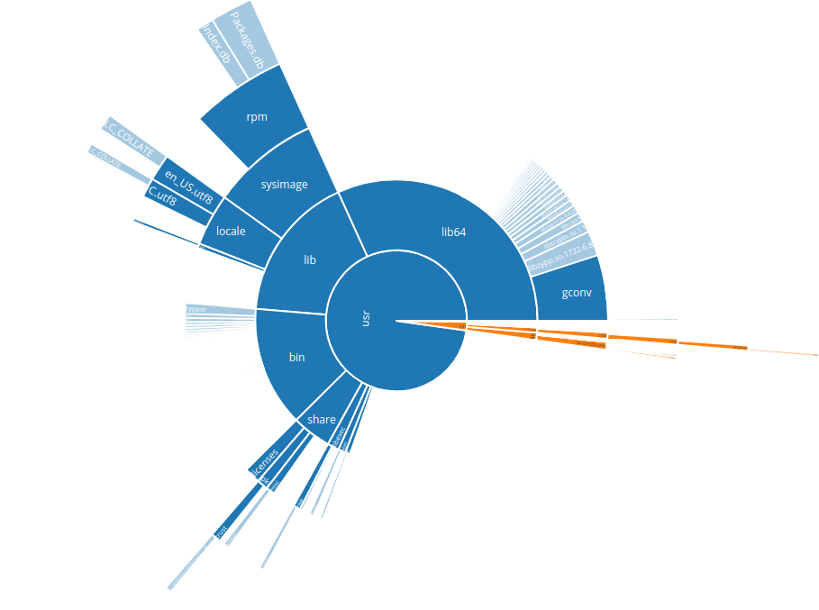

Today I'd like to point out an amazing new tool: The [Container Layer Analyzer](https://community.suse.com/posts/18455467), written by Dan Čermák. Dan also wrote a comprehensive [blog post about it](https://community.suse.com/posts/18455467), which explains it much better than what I do here.

The tool visualizes the storage requirements of a given container as a sunburst plot (you know it from the GNOME disk usage analyzer) within your webbrowser. See it for yourself, this is the plot for the current Tumbleweed container (`registry.opensuse.org/opensuse/tumbleweed`):

You can easily run this on your own machine:

    $ podman run --rm -p 5050:5050 ghcr.io/dcermak/container-layer-sizes:latest
    Ready. Listening on :5050

After starting, the web interface is running on localhost:5050.

* * *

Checkout [Dan's blog post](https://community.suse.com/posts/18455467) for more info or head directly to the [GitHub repository](https://github.com/dcermak/container-layer-sizes).

Thanks Dan for creating this amazing tool for us!
