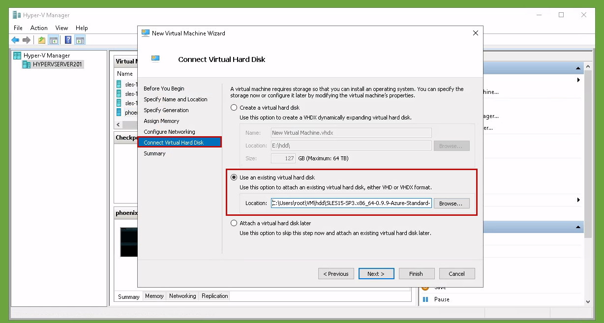
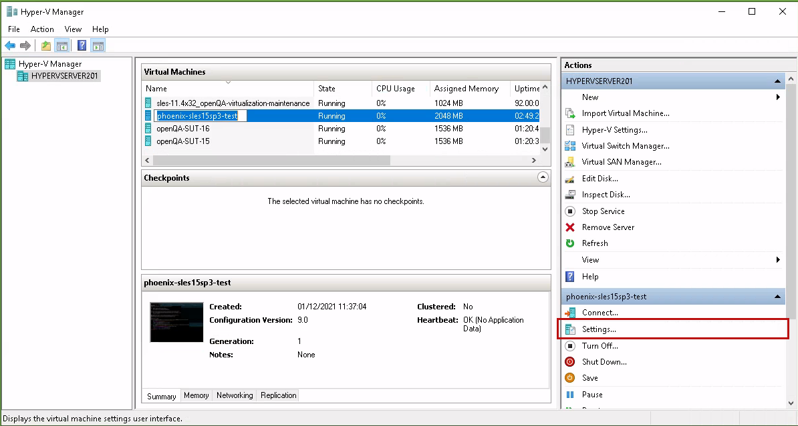
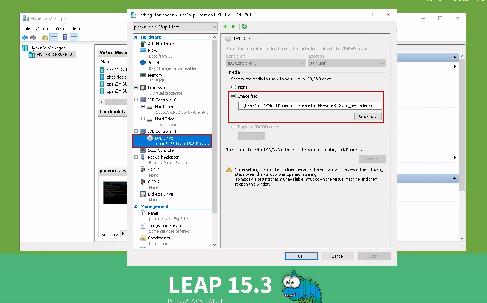
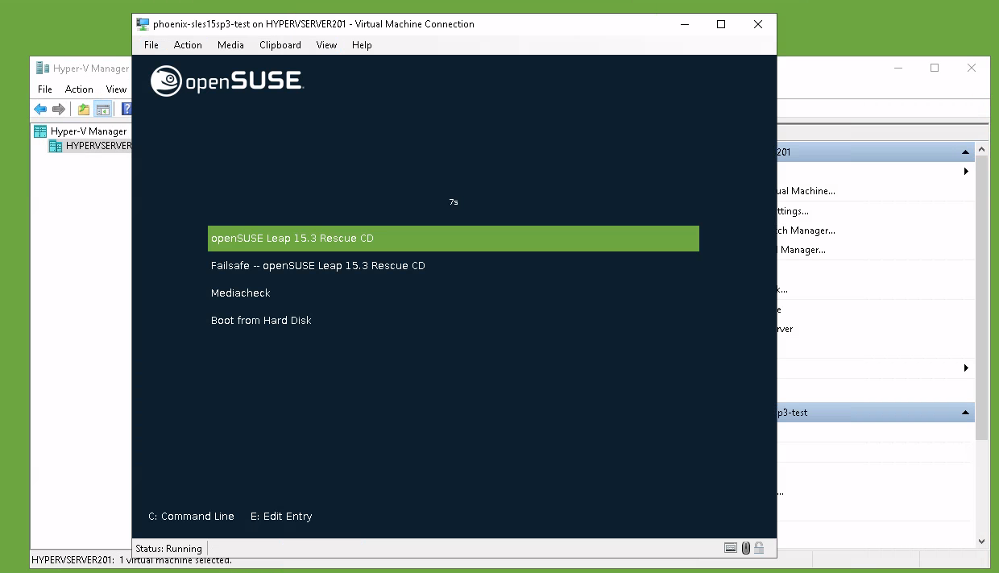
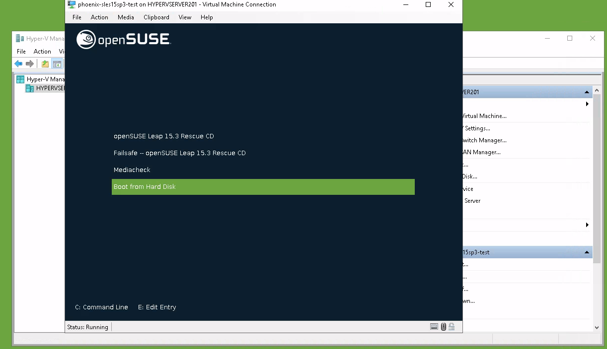
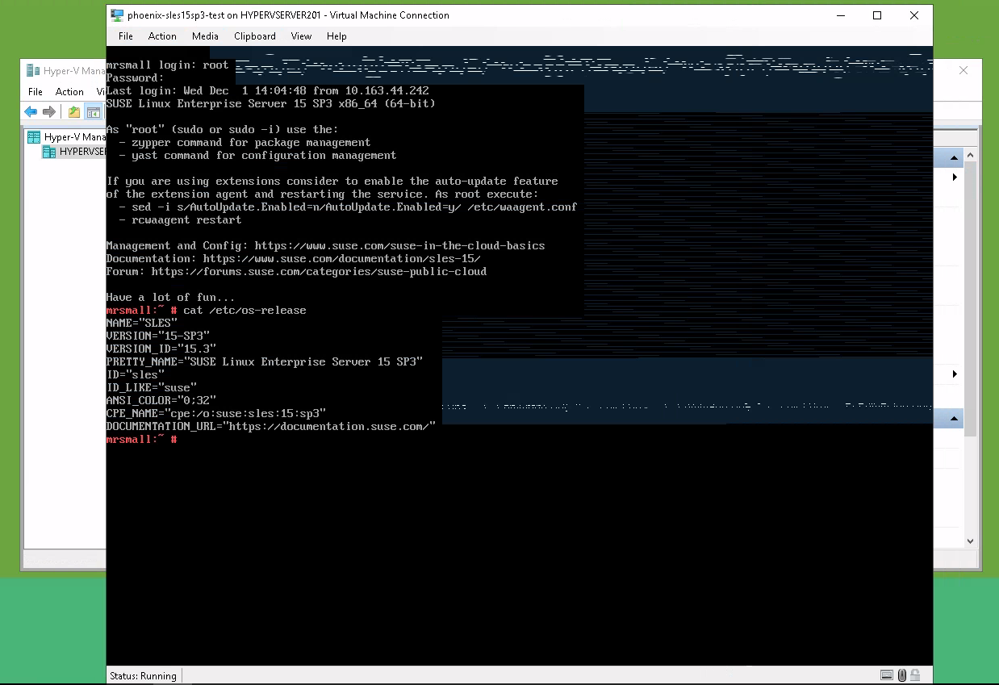

**Disclaimer: This blog post is about SUSE Linux Enterprise Server images on Azure and probably only useful to SUSE Employees who work with such images.**

Today I'm gonna show, how Azure images can be tested on a Hyper-V machine. This might be useful if you need to debug issues while being in a more controlled environment than on the Azure cloud service provider. You will need a Windows machine with HyperV installed - I runs it on my Windows 10 Professional computer and on our internal Windows 2019 Server dedicated for virtualization.

Additionally, our publiccloud images (Azure, EC2 and GCE) also work fine in kvm (more specifically in `virt-manager`)  by just importing the image file file. However, the procedure of setting the root password needs to be performed, otherwise you won't be able to login. It is completely analog to the one presented here for Hyper-V.

# TL;DR

* You can boot Azure SLES images in Hyper-V
* You need to rename the file ending from `vhdfixed` to `vhd`
* Use the hypervisor of `Generation 1` 
* The root password is not set, so you will not be able to login
* Use e.g. the openSUSE Leap Rescue CD to set the root password via a `chroot` environment

Here is the procedure for setting a root password once you booted into the Rescue environment:

    (sudo -s)
    # lsblk
    # mount /dev/sda4 /mnt
    # mount /dev/sda3 /mnt/boot
    # chroot /mnt
    # passwd

* Bonus: All SUSE publiccloud images (Azure, EC2, GCE) boot also within `virt-manager`, simply by importing the image file

# Booting an Azure image in Hyper-V

We start by downloading and prepare the image.

* Download and extract the image (it's `xz` packaged)
* Rename the file ending from `vhdfixed` to `vhd`
* Create a new `Generation 1` virtual machine and select the downloaded image as primary HDD

For this test run I pick the most recent `SLES15-SP3.x86_64-0.9.9-Azure-Standard-Build2.53.vhdfixed.xz` image and download it to the Hyper-V machine. Then you need to unpack it (e.g. `7zip`) and rename the file extension from `vhdfixed` to `vhd` so that Hyper-V recognises it.

Now create a new virtual machine in Hyper-V, and give it a fancy name (e.g. `betelgeuze` or `mr-small`). Important: Use a `Generation 1` type hypervisor, otherwise you won't be able to complete the process. Follow the wizard until you are at "Connect Virtual Hard Disk" and select the downloaded Azure image there:

Now proceed to finish and you have your VM set up. It would boot as it is (don't get fooled by the sparse output!), however you can not login, because the root password is intentionally not set on those "virgin" images.

## Setting a root password

In order to be able to login, we first need to set a root password, as the root account is disabled. On our Azure images, the root interactions are expected to happen via `sudo`, so the root account is disabled in the `/etc/shadow` file. Setting a new root password will automatically re-enable it so we can login. For Azure , typically the cloud service provider creates a new user account with `sudo` rights for you, so this is only an issue on those "virgin" images, as we are dealing with right now. In those images, this user (`azureuser`) has no password and no ssh keys, so there is no way to log in:

    # cat /etc/shadow
    root:*:18757::::::
    ...
    azureuser:!:18962:0:99999:7:::

There are many ways of solving this issue. My suggestion is that you download a openSUSE Leap Rescue DVD (Tumbleweed works just fine too), insert it into your VM, `chroot` into the system partition and set the root password with `passwd`. There are faster ways as this requires to walk a bit by foot, but it works reliably and shows you what you need in the end.

**To summarize we will do the following steps**:

1. Download the openSUSE Leap Rescue DVD (or any other Linux environment you're comfortable with)
2. Enter the VM settings
3. Select the Rescue-CD iso for the DVD Drive
4. Boot into the Rescue CD environment
5. `chroot` into the system partition
6. Change the root password via `passwd`
7. Reboot and select "Boot from Hard Disk"

Let's go though this, one step at the time

* To download the Rescue DVD go to [https://get.opensuse.org/leap](https://get.opensuse.org/leap) -> Download -> Alternative Downloads -> "Rescue LiveCD" and download the ISO from there. You can try [this direct link](https://download.opensuse.org/distribution/leap/15.3/appliances/iso/openSUSE-Leap-15.3-Rescue-CD-x86_64-Media.iso) but it might break at some point, because I will forget update it when the next version is released :-)
* Open the settings of your VM. Navigate to the CD settings and select the downloaded ISO image

* Boot the VM. It should boot automatically into the Rescue environment (Live XFCE desktop)

* Open a terminal and mount the root filesystem under `/mnt` :

The procedure is as follows:

    (sudo -s)
    # lsblk
	# mount /dev/sda4 /mnt
	# mount /dev/sda3 /mnt/boot
	# chroot /mnt
	# passwd

Use the output of `lsblk` to determine the system partition. It is typically safe to assume that it is the largest partition. Here it is `/dev/sda4` with 28.5G. The partition before (`/dev/sda3`, 1GB) is the `/boot` partition, which we technically would not need to mount, but I still do it for completeness reasons.

*Note: For GCE and EC2 images it is `/dev/sda3`, as the first partition (2M) is not present there. It is the biggest partition, so this is the signature you are looking for.*

* Now `reboot` the system (exit the `chroot` shell and then do a reboot)
* Select "Boot from Hard Disk" in the Boot menu of the Rescue CD or eject the iso file in the VM settings

* Now you should be able to login as root with your newly set password (ignore the graphical artifacts)

Congratulations! This is how you can run an SLES Azure image on your Hyper-V machine. Be aware that certain Azure-specific features will not be available: The `kernel-azure` package is installed, but the relevant hypervisor counter-part is (most probably) not available outside Azure.

# Encore: Using an Azure/GCE/EC2 image in `virt-manager`

The same procedure as above also works in `virt-manager`. The `vhd` image boots fine as a kvm-based virtual machine. All you need to do is to import the existing `vhd` image file as "SUSE Linux Enterprise 15 SP3" virtual machine.

Also here, the root account is disabled, so you need to set the root password in order to be able to login into your machine. You can simply add a SATA CDROM device and boot into a openSUSE Leap Rescue system, as explained above.

The Hyper-V hypervisor is closer to the Azure environment, so expect differences here. Don't be surprised if certain things work different here. That being said, it works and this alone might be already enough to do some issue investigation without the need to have access to the Azure cloud or a Hyper-V machine.