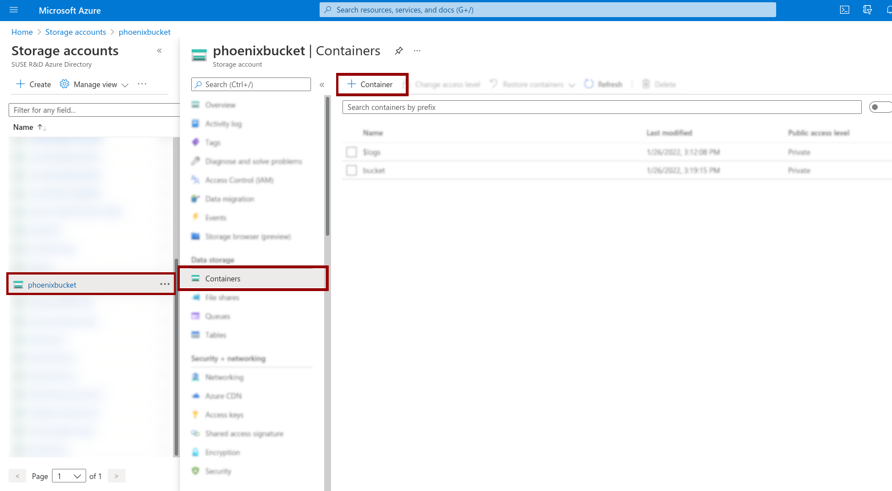

This blog post ist about uploading a custom VM disk image to the Azure cloud and create a VM to boot from this image.

If you just want to upload a image, checkout the [az_upload_img](az_upload_img) bash script at the very end of this post for a easy-to-use script without the need to dive into details.

***

When testing public cloud images, we often have to test new images that are about to be released. Although almost all of those tests are covered by openQA, sometimes it's necessary to do some manual testing. The process of uploading a custom `vhd` file to Azure is not so straightforward, yet relatively simple if someone knows how to do this. To make your life a little bit easier, I am writing this down here.

## Requirements

* Installed Azure CLI (See their [Installation overview](https://docs.microsoft.com/en-us/cli/azure/install-azure-cli) for details)
* Azure account with sufficient privileges
* A `vhd` disk image to be uploaded
* A configured storage account with a container in it (See below)

# TL;DR

* I'm assuing, you have a storage account and container configured. If not, see below

```bash
# Modify according to your needs

STORAGEACCOUNT="openqabites"            # Replace with your storage account
CONTAINERNAME="bucket"                  # Replace with the container name in storage account
IMAGENAME="my-awesome-image.vhd"        # Filename within this container
RESOURCEGROUP="openqa-bites"            # Your resource groups
DISKNAME="intermittent-disk.vhd"        # Name of the hard disk
NAME="openqabites-gold-image"           # Resulting image name


az storage blob upload --account-name "$STORAGEACCOUNT" --container-name "$CONTAINERNAME" \
  --file YOURDISKIMAGE.vdh --type page --name "$IMAGENAME"

az disk create --resource-group "$RESOURCEGROUP" --name "$DISKNAME" \
  --source "https://${STORAGEACCOUNT}.blob.core.windows.net/${CONTAINERNAME}/${IMAGENAME}"

az image create --resource-group "$RESOURCEGROUP" --name "$NAME" --os-type Linux \
  --source "$DISKNAME"
```

Addendum: the following snippet is to create a VM from this newly uploaded image:

```bash
VMNAME="zoidberg"

az vm create --resource-group "$RESOURCEGROUP" --name "$VMNAME" --image "$NAME" \
  --size Standard_A2_v2 --admin-username phoenix --ssh-key-values ~/.ssh/id_rsa.pub
```

Replace `admin-username` and the location of your ssh public key accordingly.

### Cleanup intermittent resources

```bash
# Delete the disk
az disk delete --resource-group "$RESOURCEGROUP" --name "$DISKNAME"

# Delete the storage blob
az storage blob delete --account-name "$STORAGEACCOUNT" --container-name "$CONTAINERNAME" \
  --name "$IMAGENAME"
```

### Delete the created disk image

```bash
# Delete the disk image
az image delete --resource-group "$RESOURCEGROUP" --name "$NAME"
```

***

# Create Storage account and Container

*Note: You will only need to do this once. Once it is configured, you're good to go.*

***

In the [Azure WebUI](portal.azure.com/) (seriously, how many redirects can one have after a single login?) search for "Storage accounts" and then click "Create". There, select (or create) a "Resource group", where the image should be available. 

*Think of "Resource groups" your own sandboxing namespace. You can have any resource in a Resource group, which is separated from the other Resource groups.*

Give the Storage account a good name and select the same region where the Resource group is located. For simple testing the rest of the settings can be left untouched.



After creating the Storage account, move to it by clicking on it in the list. Then move to Containers and add a new Container by clicking on the "+ Container" button. Now give your container an awesome name, e.g. `bucket`.

***

# Walkthrough

## Procedure to create a VM disk image

1. Upload the `vdh` file to a container
2. Create a disk from the uploaded `vdh` file
3. Create an image out of the created disk
4. (Create a VM from this image)

I assume, the [azure-cli](https://docs.microsoft.com/en-us/cli/azure/) has been installed and you are logged in (`az login`).

### Upload the vdh image to a container

```bash
STORAGEACCOUNT="openqabites"            # Replace with your storage account
CONTAINERNAME="bucket"                  # Replace with the container name in that storage account
IMAGENAME="my-awesome-image.vhd"        # Filename within this container

az storage blob upload --account-name "$STORAGEACCOUNT" --container-name "$CONTAINERNAME" \
  --file YOURDISKIMAGE.vdh --type page --name "$IMAGENAME"
```

The upload takes some time and a considerable amount of CPU resources for an upload. I guess the image is being compressed, because on my Laptop a whole CPU core was fully occupied during the whole process.

`$IMAGENAME` is the filename in the container and can be anything. This won't affect the image name in the end.

### Create a disk from the uploaded `vdh` file

```bash
RESOURCEGROUP="openqa-bites"            # Your resource groups
DISKNAME="intermittent-disk.vhd"        # Name of the hard disk

# $IMAGENAME is being used from the previous step

az disk create --resource-group "$RESOURCEGROUP" --name "$DISKNAME" \
  --source "https://${STORAGEACCOUNT}.blob.core.windows.net/${CONTAINERNAME}/${IMAGENAME}"
```

Here we create a new hard disk out of the previously uploaded disk image. Also here, `$DISKNAME` is just for this and the next step and will have no impact on the resulting vm image name.

### Create an image out of the created disk

```bash
NAME="openqabites-gold-image"           # Resulting image name

# $RESOURCEGROUP and $DISKNAME are being used from the previous step

az image create --resource-group "$RESOURCEGROUP" --name "$NAME" --os-type Linux \
  --source "$DISKNAME"
```

This creates a new VM image out of the previously generated hard disk. The deine `$NAME` is the name of the resulting VM image within this resource group.

### Create a VM from this image 

```bash
VMNAME="zoidberg"                       # Give your VM a nice name!

# $NAME is the image name from the previous step

az vm create --resource-group "$RESOURCEGROUP" --name "$VMNAME" --image "$NAME" \
  --size Standard_A2_v2 --admin-username phoenix --ssh-key-values ~/.ssh/id_rsa.pub \
  --public-ip-sku Standard
```

Modify the `admin-username` and the location for your ssh key accordingly. I'm just using the default stuff.

## Cleanup

Note: In all steps we use the variables defined in the steps above.

Resources should always be cleaned up in the reverse order of their creation.

```bash
# Note: We take the variables from the steps above

# Delete the disk image
az image delete --resource-group "$RESOURCEGROUP" --name "$NAME"

# Delete the disk
az disk delete --resource-group "$RESOURCEGROUP" --name "$DISKNAME"

# Delete the storage blob
az storage blob delete --account-name "$STORAGEACCOUNT" --container-name "$CONTAINERNAME" \
  --name "$IMAGENAME"
```

***

# Bash script

I wrote a small [az_upload_img](az_upload_img) bash script, which performs all of those steps for you. In addition it is able to unpack a `xz` archive before uploading and would rename a `.vhdfixed` to `.vhd` for you. The later is needed because we distinguish vhd with preallocated space (fixed size) from vhd which do not need that.

    Usage: az_upload_img [-acirdfn]
       -a   Define storage account
       -c   Define container name (default: bucket)
       -i   Define container filename
       -r   Define resource group
       -d   Define disk name
       -f   Input file
       -n   Image name

The most basic usage is the following

     You need at least the following arguments:
      -a storage_account
      -c container_within_that_storage_account
      -f input_file.vhd[.xz]
      -n resulting_image_name
      
    $ az_upload_img -r testgroup -a testaccount -c bucket -n my_image -f my_image.xz

The script is provided as-is. Given that the azure CLI is undergoing sometimes backwards incompatible changes there is a high chance, that the script will need some adjustments after some time.
However, given that we use only very basic commands I hope it will remain functional for some time.

Have a lot of fun!