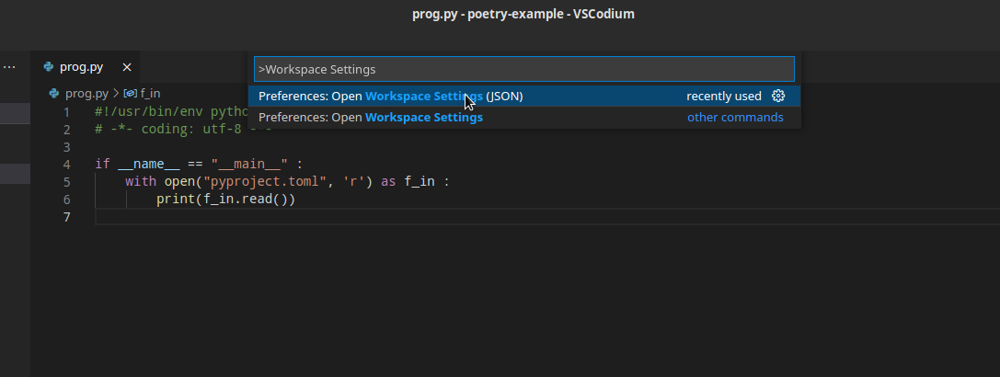
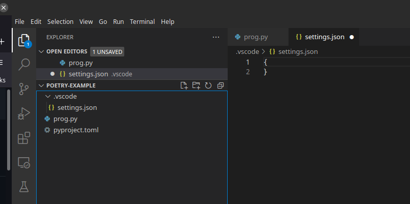
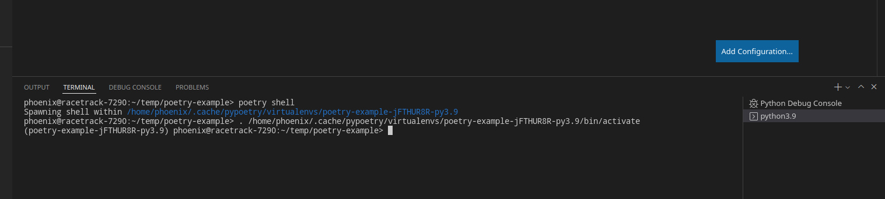
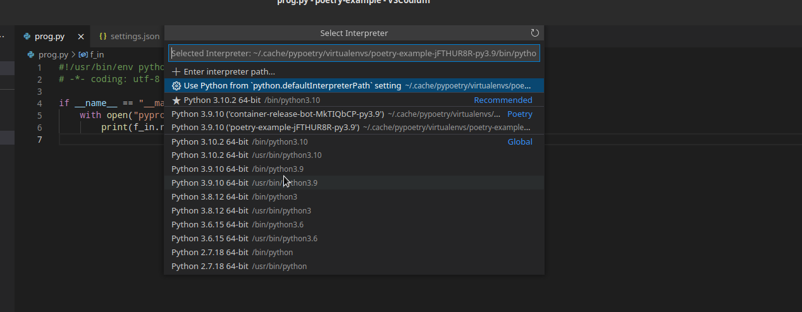
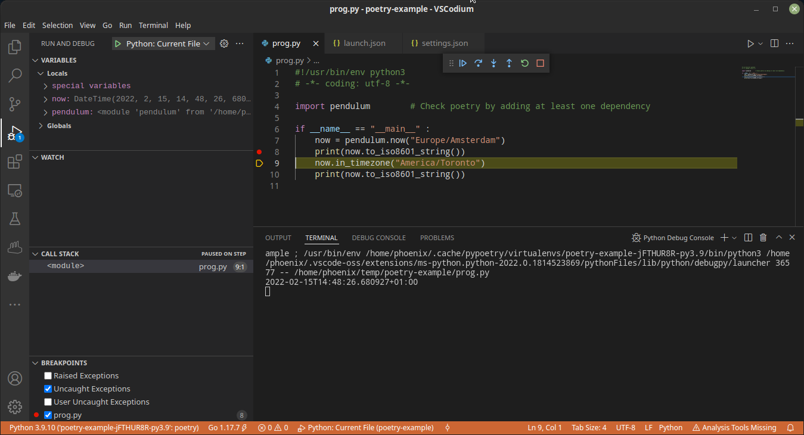

[poetry](https://python-poetry.org/) is (yet another) python packaging and dependency management system. In this blog post I'm gonna describe how I am working with poetry repositories within [VS Codium](https://vscodium.com/), the freely licensed variant of VS Code.

Now, the most easy way is to simply run

    poetry run codium      # VS Codium
    poetry run code        # VS Code

In this case, `poetry` sets up the environment for you and you should be ready to go.
However if for some reason that does not work for you or it is inpractical, one can configure it also manually. This is what we will do in this tutorial.

In this tutorial we will:

1. Create a new poetry project
2. Import project into VS Code
3. Launch project with the debugger

# TL;DR

1. Create the poetry project: `poetry init`
2. Determine the poetry virual environment path using `poetry shell`. Search for the following line:

```
Spawning shell within /home/phoenix/.cache/pypoetry/virtualenvs/poetry-example-jFTHUR8R-py3.9
```

3. Edit the VS Code workspace `settings.json` to use this virtual environment:

```json
{
    "python.pythonPath": "/home/phoenix/.cache/pypoetry/virtualenvs/poetry-example-jFTHUR8R-py3.9",
    "python.defaultInterpreterPath": "/home/phoenix/.cache/pypoetry/virtualenvs/poetry-example-jFTHUR8R-py3.9/bin/python3"
}
```

4. Make sure to configure the Python interpreter to use the `defaultInterpreterPath`!

5. Create your launch configuration just the way you normally do, e.g.

```json
{
    "version": "0.2.0",
    "configurations": [
        {
            "name": "Python: Current File",
            "type": "python",
            "request": "launch",
            "program": "${file}",
            "console": "integratedTerminal"
        }
    ]
}
```


# Tutorial

## 1. Create a new poetry project

You can either import an existing poetry project or create a new one. If you have already a poetry project, then you can skip this step and immediately head down to step 2, "Import project into VS Code".

For this tutorial we create the directory `poetry-example` and will use this for our project. We initialize our poetry project with `poetry init`:

```bash
phoenix@racetrack-7290:~> mkdir poetry-example && cd poetry-example
phoenix@racetrack-7290:~/poetry-example> poetry init
```

This will trigger the following procedure

    This command will guide you through creating your pyproject.toml config.

    Package name [poetry-example]:  
    Version [0.1.0]:  
    Description []:  My poetry example
    Author [phoenix <felix.niederwanger@suse.com>, n to skip]:  
    License []:  MIT
    Compatible Python versions [^3.9]:  

    Would you like to define your main dependencies interactively? (yes/no) [yes] yes
    You can specify a package in the following forms:
      - A single name (requests)
      - A name and a constraint (requests@^2.23.0)
      - A git url (git+https://github.com/python-poetry/poetry.git)
      - A git url with a revision (git+https://github.com/python-poetry/poetry.git#develop)
      - A file path (../my-package/my-package.whl)
      - A directory (../my-package/)
      - A url (https://example.com/packages/my-package-0.1.0.tar.gz)

    Search for package to add (or leave blank to continue): pendulum^2.0.5
    Adding pendulum^2.0.5

    Add a package: 

    Would you like to define your development dependencies interactively? (yes/no) [yes] no
    Generated file

    [tool.poetry]
    name = "poetry-example"
    version = "0.1.0"
    description = "My poetry example"
    authors = ["phoenix <felix.niederwanger@suse.com>"]
    license = "MIT"

    [tool.poetry.dependencies]
    python = "^3.9"
    pendulum = "^2.0.5"

    [tool.poetry.dev-dependencies]

    [build-system]
    requires = ["poetry-core>=1.0.0"]
    build-backend = "poetry.core.masonry.api"


    Do you confirm generation? (yes/no) [yes] yes

This will create the [pyproject.toml](pyproject.toml) of your project for you, which contains the configuration for poetry. To download the dependencies you might need to run `poetry update`

```bash
phoenix@racetrack-7290:~/poetry-example> poetry update
```

Next, let's add our main program by adding the following [prog.py](prog.py) file to the directory

```python
#!/usr/bin/env python3
# -*- coding: utf-8 -*-

import pendulum        # Check poetry by adding at least one dependency

if __name__ == "__main__" :
        now = pendulum.now("Europe/Amsterdam")
        print(now.to_iso8601_string())
        now.in_timezone("America/Toronto")
        print(now.to_iso8601_string())
```

This is our project. You can download the complete example file here: [poetry-example.tar.bz2](poetry-example.tar.bz2).

## 2. Import project into VS Code

This is the tricky part. But the essence is to configure the workspace `settings.json` to use the virtual environment of the poetry repository. We will do this now step by step.

First, open the project in VS Code. Then, via the command palette (`CTRL+SHIFT+P`), open the `Workspace Settings (JSON)`. **Make sure you edit the Workspace `settings.json` and not your global `settings.json`**! You want to edit the workspace settings to use this poetry virtual environment and not all of your python project to use this particular virtualenv.



You can double-check if you have the right `settings.json`, by looking if a new file `settings.json` has appeared in the `.vscode` directory within the workspace:



Now we need to edit the `settings.json` to use the poetry virtualenv for this project. We will find out in the next step how to determine the path of this virtualenv:

```json
{
	"python.pythonPath": "/home/phoenix/.cache/pypoetry/virtualenvs/poetry-example-jFTHUR8R-py3.9",
	"python.defaultInterpreterPath": "/home/phoenix/.cache/pypoetry/virtualenvs/poetry-example-jFTHUR8R-py3.9/bin/python3"
}
```

How do we get the path to the pypoetry/virtualenvs? The easiest way is to run a `poetry shell` within the project directory. You can do this directly from within VS Code (Use ```CTRL+` ``` to open the terminal)



```
phoenix@racetrack-7290:~/temp/poetry-example> poetry shell
Spawning shell within /home/phoenix/.cache/pypoetry/virtualenvs/poetry-example-jFTHUR8R-py3.9
phoenix@racetrack-7290:~/temp/poetry-example> . /home/phoenix/.cache/pypoetry/virtualenvs/poetry-example-jFTHUR8R-py3.9/bin/activate
(poetry-example-jFTHUR8R-py3.9) phoenix@racetrack-7290:~/temp/poetry-example> 
```

Here you can see the path to the virtualenv - look at the line starting with `Spawning shell within`. Use this path for the `python.pythonPath` setting and this path plus `/bin/python3` (We are using python3, aren't we?) for the `python.defaultInterpreterPath`.
Save the file and close the `settings.json` editor.

The last step is to ensure, that we are using the Python interpreter defined in `python.defaultInterpreterPath`. Open the command palette (`CTRL+SHIFT+P`), go to "Python: Select Interpreter" and select the "Use Python from `python.defaultInterpreterPath` setting" as shown here:



Congratulations, your workspace is now configured to use poetry instead of the system python environment.

## 3. Launch project with the debugger

From here onward it's just a normal Python project. Create your launch configuration, e.g. as shown below (this is the default template)

```json
{
    "version": "0.2.0",
    "configurations": [
        {
            "name": "Python: Current File",
            "type": "python",
            "request": "launch",
            "program": "${file}",
            "console": "integratedTerminal"
        }
    ]
}
```

Then you can run your python program and use the intergrated debugger just like you would do with any normal project.



That's it! I hope you use this to create something awesome 😃🚀