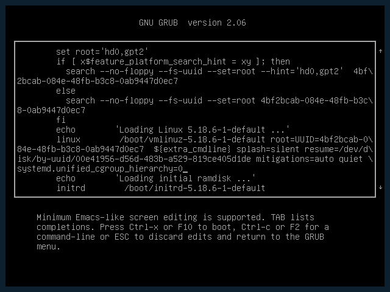

[Ansible Molecule](https://molecule.readthedocs.io/en/latest/index.html) is a project to help you test your ansible roles. I'm using molecule for automatically testing the ansible roles of [geekoops](https://geekoops.github.io/).

So, while hacking on the geekoops roles, `molecule test` was complaining on my Tumbleweed machine:

    "Failed to connect to bus: No such file or directory"

More specifically the error that `molecule test` spits out looks like the following:

```
TASK [geekoops-nginx : Ensure nginx service is enabled] *************************************
fatal: [leap15]: FAILED! => {"changed": false, "cmd": "/usr/bin/systemctl", "msg": "Failed to connect to bus: No such file or directory", "rc": 1, "stderr": "Failed to connect to bus: No such file or directory\n", "stderr_lines": ["Failed to connect to bus: No such file or directory"], "stdout": "", "stdout_lines": []}

PLAY RECAP **********************************************************************************
leap15                     : ok=3    changed=1    unreachable=0    failed=1    skipped=0    rescued=0    ignored=0


```


After a bit of Googling I figured the underlying issue is probably [a change in systemd 248](https://github.com/systemd/systemd/issues/19245), which makes docker not being able to mount the cgroups. A [useful comment](https://github.com/systemd/systemd/issues/19245#issuecomment-815891960) in the filed issue finally was working, and I could resume testing on Tumbleweed.

So, if you see this error while running `molecule test`, a practical workaround is to set boot your system with the kernel parameter:

    systemd.unified_cgroup_hierarchy=0

You can enter it directly in grub, or edit `/etc/default/grub` and put it into `GRUB_CMDLINE_LINUX_DEFAULT` there. I don't recommend to the latter, as this is only a temporary workaround until this is fixed and you probably forget to remove it.



