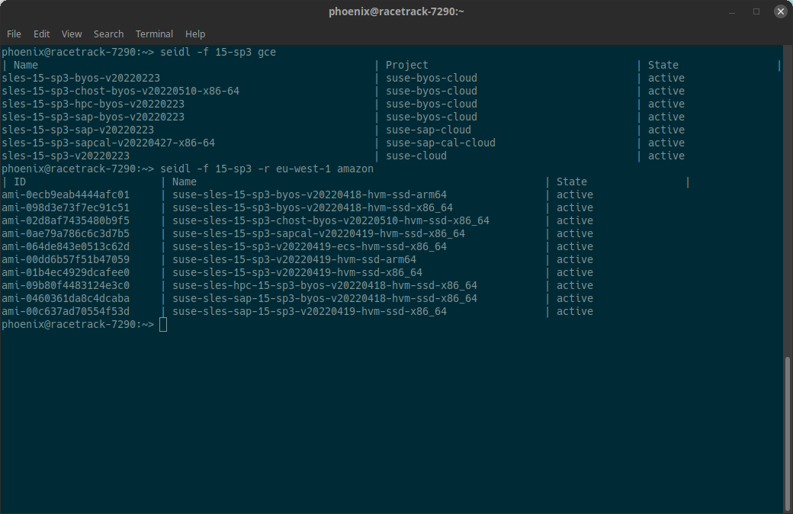

[seidl](https://github.com/grisu48/seidl) is a small [pint](https://pint.suse.com/) query utility designed to easily list the current publiccloud images in the terminal. Pint (Public Cloud Information Tracker) is the SUSE service to provide data about the current state of publiccloud images across all supported public cloud service providers. The [public-cloud-info-client](https://github.com/SUSE-Enceladus/public-cloud-info-client) is an already existing versitale client, however I find its usage a bit bulky if it comes to the task of displaying the current images. This is where `seidl` complements the existing client. See for yourself:



`seidl` is named after a small beer quantity in Austria because it's slightly smaller than a pint. See [Wikipedia](https://de.wikipedia.org/wiki/Seidel_(Einheit)#Bierma%C3%9F).

## TL;DR

Project page: https://github.com/grisu48/seidl | Binaries: [Releases](https://github.com/grisu48/seidl/releases)

Usage:

    seidl [OPTIONS] CSP...

Simple query

    seidl gce                         # List all current GCE images
    seidl azure                       # List all current Azure images
    seidl -r eu-west-1 ec2            # List all current AWS images in eu-west-1

Filtering

    seidl -f 'sap' -r eu-west-1 ec2   # List all SAP images in the eu-west-1 region on AWS
    seidl -f 'sles,15-sp2' gce        # Filter for "sles" and for "15-sp2" on GCE

Valid options for the CSP are:

    Google Cloud Platform:             g, gce, gcp, google
    Azure:                             m, az, azure, microsoft
    Amazon Web Services:               a, aws, ec2, amazon

`seidl` is written in pure go with no dependencies, and is therefore easy to build yourself via the provided Makefile (lazy way: `make seidl install`).

For Tumbleweed there is a package available in the main package repository:

    zypper in seidl                    # Tumbleweed only at the moment

Pre-build binaries for other Linux platforms are available on the [releases page](https://github.com/grisu48/seidl/releases) or via

    wget https://github.com/grisu48/seidl/releases/download/v0.1/seidl
    chmod +x seidl
    ./seidl -h

# Usage

    Usage: seidl [OPTIONS] CSP...

The basic usage is to query all current images of a specific cloud service provider (CSP):

    seidl gce
    seidl azure
    seidl -r eu-west-1 ec2            # Amazon requires a region

`seidl` tries to match various widely used names for its CSP. This is why `az`,`azure` and `microsoft` are all matching for Azure, `ec2`,`aws` or `amazon` for AWS and `gce`, `gcp`, `google` or simply `g` for the Google Cloud Platform. The aim is to make it intuitive for the users to use, without having to remember a specific wording for this utility.

For Amazon/EC2, the tool requires a region to be defined (`-r` or `--region`), because the image AMIs are region dependent. You can use `seidl --list-aws-regions` to display all AWS regions.

    seidl --list-aws-regions

In addition, `seidl` supports filtering images by providing a comma-separated list of substrings, e.g.

    seidl -f 'sap' -r eu-west-1 ec2       # Filter for images containing "sap"
    seidl -f 'sles,15-sp2' gce            # "sles" and "15-sp2" must be present

Important: `OPTIONS` must be present BEFORE the CSP name. This is required, as the tool supports multiple request at the same time, and each CSP can have it's own set of options:

```
$ seidl -f 15-sp2 gce -f sap -r eu-west-1 ec2
| Name                                                       | Project                                  | State                |
sles-15-sp2-byos-v20220126                                   | suse-byos-cloud                          | inactive            
sles-15-sp2-chost-byos-v20220126                             | suse-byos-cloud                          | inactive            
sles-15-sp2-sap-byos-v20220126                               | suse-byos-cloud                          | inactive            
sles-15-sp2-sap-v20220126                                    | suse-sap-cloud                           | inactive            
| ID                      | Name                                                         | State                |
ami-06c5ae96e17d6d72f     | suse-sles-15-sp1-sapcal-v20220128-hvm-ssd-x86_64             | inactive            
ami-0ae79a786c6c3d7b5     | suse-sles-15-sp3-sapcal-v20220419-hvm-ssd-x86_64             | active              
ami-06417e78e96ee8667     | suse-sles-sap-12-sp4-byos-v20220201-hvm-ssd-x86_64           | inactive            
ami-0962592be7449be49     | suse-sles-sap-12-sp4-v20220304-hvm-ssd-x86_64                | inactive            
ami-053ca34a3b90a782b     | suse-sles-sap-12-sp5-byos-v20220429-hvm-ssd-x86_64           | active              
ami-0089c048670ed2fd4     | suse-sles-sap-12-sp5-v20220305-hvm-ssd-x86_64                | active              
ami-0afeaa2872bc05302     | suse-sles-sap-15-byos-v20220131-hvm-ssd-x86_64               | inactive            
ami-05fb8fa3ed3d80cd8     | suse-sles-sap-15-sp1-byos-v20220131-hvm-ssd-x86_64           | inactive            
ami-00cc2a3d10de33ac4     | suse-sles-sap-15-sp1-v20220304-hvm-ssd-x86_64                | inactive            
ami-0cda4818e94b2acf3     | suse-sles-sap-15-sp2-byos-v20220131-hvm-ssd-x86_64           | inactive            
ami-071cfba4768821b39     | suse-sles-sap-15-sp2-v20220304-hvm-ssd-x86_64                | inactive            
ami-0460361da8c4dcaba     | suse-sles-sap-15-sp3-byos-v20220418-hvm-ssd-x86_64           | active              
ami-00c637ad70554f53d     | suse-sles-sap-15-sp3-v20220419-hvm-ssd-x86_64                | active              
ami-0f3c4af510e3f551a     | suse-sles-sap-15-v20220304-hvm-ssd-x86_64                    | inactive
```

# Installation

`seidl` is available in the Tumbleweed package repository:

    zypper in seidl                  # Tumbleweed

For other platforms I provide a binary in its [github repository releases](https://github.com/grisu48/seidl/releases):

    # Note: don't trust binaries from a random dude from the internet :-)
    wget https://github.com/grisu48/seidl/releases/download/v0.1/seidl
    chmod +x seidl
    ./seidl -h

Alternatively, building yourself is trivially easy, as `seidl` requires no external dependencies. It's pure `go`. Build instructions are present in the [Github repository](https://github.com/grisu48/seidl/#build) but it's as simple as

    git clone https://github.com/grisu48/seidl.git
    cd seidl
    make
    make install                         # installs it to ~/bin