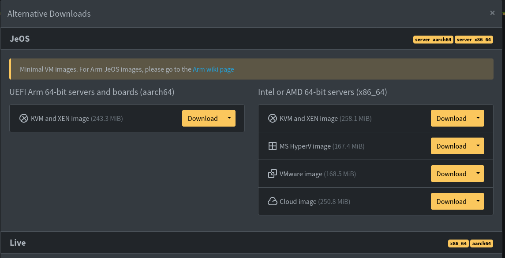
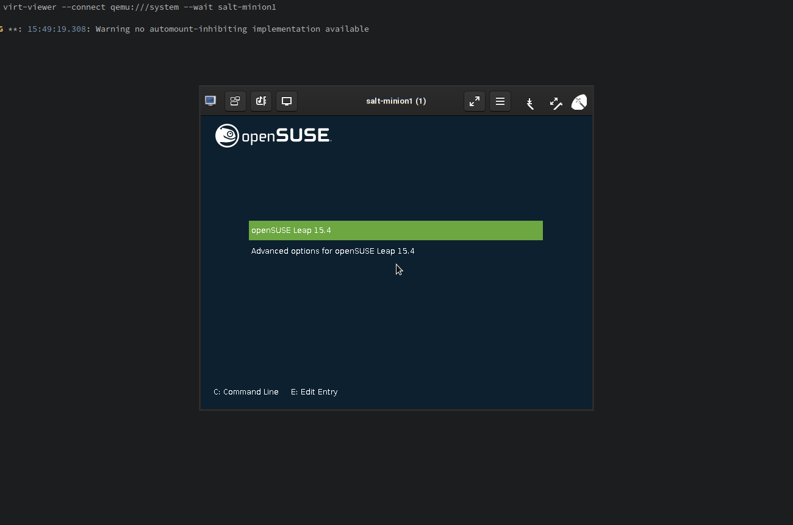

JeOS (Just enough OS) or MinimalVM images are minimal VM images (duh!) that can be used to quickly deploy VMs. Instead of a installation you only need to go through a first boot setup. This makes those images very handy if you need to spin up a bunch of test VMs as for instance if you need a custom cluster.

In my particular case I needed to spin up a Salt Master/Minion cluster with 1 master and 2 minions.

Disclaimer: There are more advanced settings like e.g. [libguestfs-tools](https://en.opensuse.org/Portal:JeOS:Documentation:libguestfs-tools) that allow further customization and automation of the task, for the purpose of simplicity I will stick to the basics. Installation for JeOS images takes less than 1 minute, and for just a small number of VMs it's just fine to do this by hand.

# Setting up a VM cluster with 3 openSUSE hosts in 5 minutes

(Possible slow download time excluded)

We are going to perform the following setup:

* 3 VM hosts that will use the same JeOS VM image
* Each host has it's own disk as qemu overlay disk
* We will not automate the JeOS installation itself, because for 3 machines it's not necessary

## Setting up the VM disks

First, download the latest JeOS image. I used Leap for my setup, you can use Tumbleweed or whatever you like. Download the latest image from [get.opensuse.org](http://get.opensuse.org/) and go to the Alternative Downloads. There you find the KVM and XEN image (or the corresponding other images).



Assuming the JeOS image is `openSUSE-Leap-15.4-JeOS.x86_64-kvm-and-xen.qcow2` we now create three disks as qemu overlay images. This means all of them will use the `openSUSE-Leap-15.4-JeOS.x86_64-kvm-and-xen.qcow2` image as underlying base image and only the changes of the corresponding system will be stored in the overlay. All VMs will be using the same base image and only their own stuff will be stored in their own qcow2 disk image - that's neat!

To create the disks `master.qcow2`, `minion1.qcow2` and `minion2.qcow2` with 30GiB each, we do

```
qemu-img create -b openSUSE-Leap-15.4-JeOS.x86_64-kvm-and-xen.qcow2 -F qcow2 -f qcow2 master.qcow2 30G
qemu-img create -b openSUSE-Leap-15.4-JeOS.x86_64-kvm-and-xen.qcow2 -F qcow2 -f qcow2 minion1.qcow2 30G
qemu-img create -b openSUSE-Leap-15.4-JeOS.x86_64-kvm-and-xen.qcow2 -F qcow2 -f qcow2 minion2.qcow2 30G
```

Now you can just use the resulting disk images `master.qcow2`, `minion1.qcow2` and `minion2.qcow2` when creating your VMs

## Create the VMs

We just use `virt-install` to create VMs from the already existing disk images. As said before, the installation process is so simple, that for just a handful of machines it's really no issue to do this manually.

    # Execute one after another
    virt-install --name=salt-master --disk=/srv/virt/images/master.qcow2 --import --os-variant=opensuse15.4 --vcpus=2 --ram=2048
    virt-install --name=salt-minion1 --disk=/srv/virt/images/minion1.qcow2 --import --os-variant=opensuse15.4 --vcpus=2 --ram=2048
    virt-install --name=salt-minion2 --disk=/srv/virt/images/minion2.qcow2 --import --os-variant=opensuse15.4 --vcpus=2 --ram=2048

The installation takes less than a minute



And that's it. In less than 5 minutes you should be up and running with your own 3 VMs cluster using JeOS or MinimalVM images 😀
