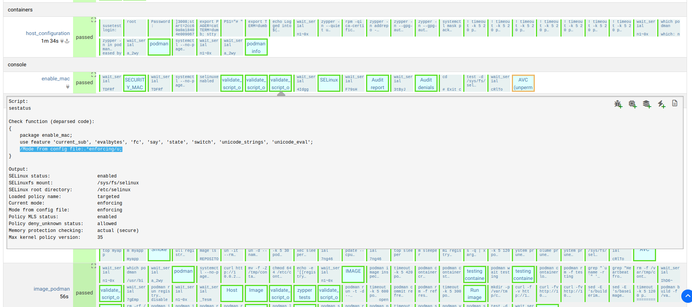

In OpenQA one has often to check the output of a command. Now most of us think foremost "this is a task for my beloved `grep`":

```sh
echo "Command runs successfully" | grep "successfully"
```

This works and is also common but it has one major problem:
In the error case it doesn't show the actual output. It swallows the input and doesn't show anything.

Luckily openQA has a internal routine [validate_script_output](https://open.qa/api/testapi/#validate_script_output) which handles this
case. The main advantage of `validate_script_output` over a typical `assert_script_run("... | grep ...")` is that
it shows both the actual and the expected output. This makes debugging and job investigation easier for a reviewer
(man and artificial construct alike) as one has not to guess or find workarounds to show the actual output. It is already there:

[](validate_script_output.png)

Here one can see the deparsed code of what openQA tries to match:

```
/Mode from config file:.*enforcing/u;
```

Versus the actual Output what the command gives:

```
Output:
SELinux status:                 enabled
SELinuxfs mount:                /sys/fs/selinux
SELinux root directory:         /etc/selinux
Loaded policy name:             targeted
Current mode:                   enforcing
Mode from config file:          enforcing
Policy MLS status:              enabled
Policy deny_unknown status:     allowed
Memory protection checking:     actual (secure)
Max kernel policy version:      35
```

## TLDR

Using `validate_script_output` shows the actual output and the expected pattern directly
in openQA is thus typically the better choice than a `assert_script_run("... | grep ...")`.